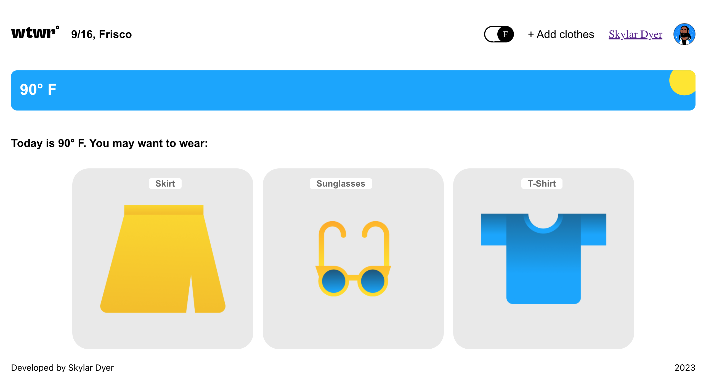
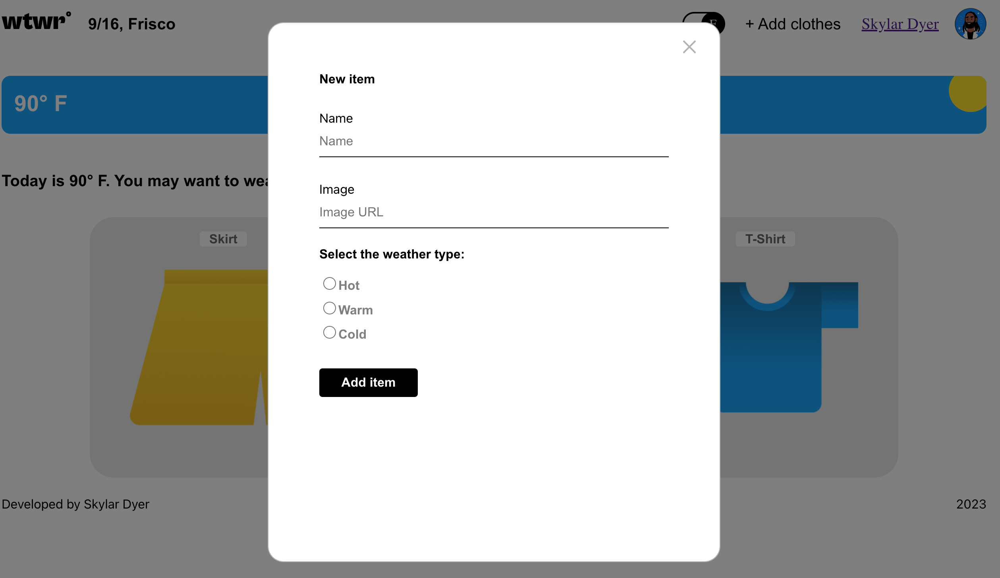
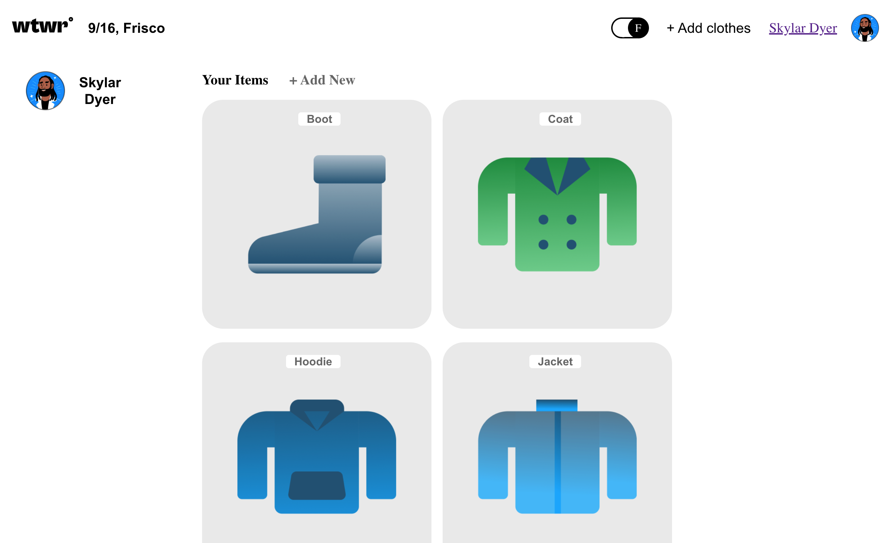
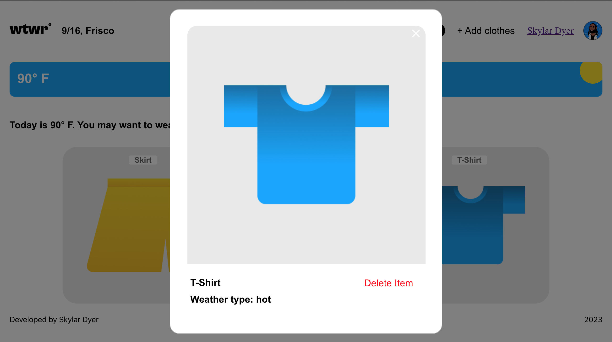

# WTWR (What to Wear?)

## About the project

The idea of the application is pretty simple - we make a call to an API, which then responds with the daily weather forecast. We collect the weather data, process it, and then based on the forecast, we recommend suitable clothing to the user.

## Screenshot

Homepage

Add New Card

Profile Page

Preview Card

## Figma

- [Figma Design](https://www.figma.com/file/DTojSwldenF9UPKQZd6RRb/Sprint-10%3A-WTWR)

## Languages and Technologies

- HTML
- CSS
- Figma
- OOP
- JavaScript
- Git
- JSON
- Webpack
- GitHub
- Fetch API
- React